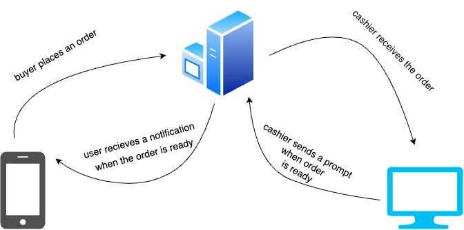
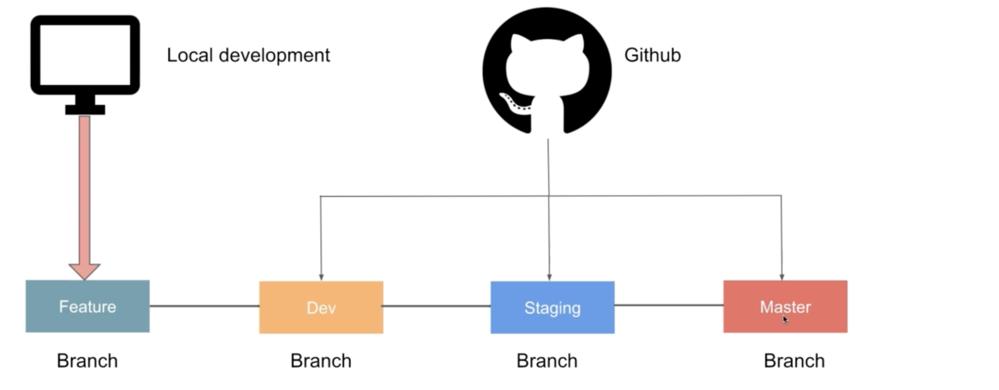
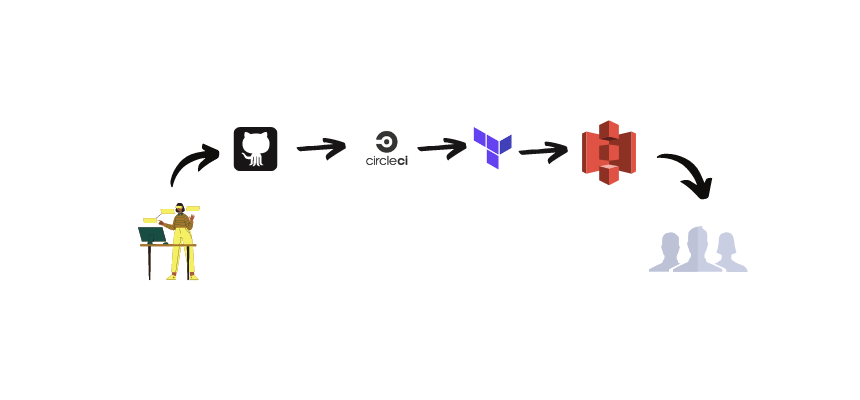

# The Hungry Soul

### Our Story:

The Hungry Soul was created as a final year project for B.Tech by [Dibyajyoti Mishra](https://linkedin.com/in/dibyajyotim), [Abhilash C](https://www.linkedin.com/in/abhilashc1), [Srikar V](https://www.linkedin.com/in/srikar-v-8b6619222/), [Saketh D](https://www.linkedin.com/in/saketh-dodda-ba83b8203).

The whole aim of the project was to completely change the way people order their food at the college canteen. Prior to this, there used to be a cashier at the canteen who used to have a hard time managing so many buyers at the same time and also managing the cash and the inventory. Therefore, we decided to take it up as one of the problem.

The problem at our hands was to :

1.  Make it easier for the cashier to handle the orders.
2.  Make it comfortable for the students to place order. (Instead of waiting in the queues, they could simply place an order on their mobiles/laptops).
3.  To maximise the profit for the organisation with the help of ML applications like Recommendation engine, and Prediction models.

The way in which the whole workflow is set is something like this:

 
 

Let's talk about tech:
To solve this problem, we had multiple discussions and did multiple rounds of research and finally agreed upon the following:

1. <strong>[Progressive Web Application](https://www.freecodecamp.org/news/what-are-progressive-web-apps)</strong>:
   Well, we didn't want people to feel the pain of downloading another app and filling up their already loaded device, so we wanted to go for something very light and powerful, and PWAs are one of the best choices then. They provide native app like experience without the need of having to download the app from Playstore or Appstore. Plus, it is much more accessible than a mobile app.

2. <strong>[React](https://react.dev)</strong>:
   The frontend is powered by React JS. Undoubtedly, it is the most used JS framework and needs no introduction. Still, if you want to know more, visit [react official docs](https://react.dev).

3. <strong>[Redux](https://redux-saga.js.org/)</strong>:
   To manage the internal state of the application, we have used redux and redux saga. Redux is an open-source JavaScript library for managing and centralizing application state. It is most commonly used with libraries such as React or Angular for building user interfaces. It helps the application behave consistently across all states.

4. <strong>[TypeScript](https://www.typescriptlang.org)</strong>:
   Noone likes spending their weekends on bugs which might come in due to some carelessness and lack of knowledge about the component and its props. Typescript comes to a rescue here. Javascript is a loosely typed language, typescript makes it less error-prone by explicitely checking for the types during the compile time itself. It saves tons of debugging time and litres of coffee.
5. <strong>[SCSS](https://sass-lang.com)</strong>:
   Officially described as “CSS with superpowers,” SCSS (or Sass) offers a way to write styles for websites with more enhanced CSS syntax. In general, browsers do not know how to process SCSS features, such as functions, mixins, and nesting. We'll need to convert them to regular CSS files to run them in the browser.

6. <strong>[CircleCI](https://circleci.com/)</strong>:
   CircleCI is a continuous integration and continuous delivery platform that is used to implement DevOps practices. CircleCI makes it easy to connect all of your favorite tools to build the way you want. It automates the workflows and saves a lot of pain in doing monotonous deployment tasks.

7. <strong>[Terraform](https://www.terraform.io/)</strong>:
   HashiCorp Terraform is an infrastructure as code tool that lets you define both cloud and on-prem resources in human-readable configuration files that you can version, reuse, and share. You can then use a consistent workflow to provision and manage all of your infrastructure throughout its lifecycle. It can manage low-level components like compute, storage, and networking resources, as well as high-level components like DNS entries and SaaS features. It creates and manages resources on cloud platforms and other services through their application programming interfaces (APIs).

8. <strong>[AWS S3](https://aws.amazon.com/s3/?did=ap_card&trk=ap_card), [CloudFront](https://aws.amazon.com/cloudfront/?did=ap_card&trk=ap_card)</strong>:
   AWS S3 is used to store the static files of the application which is generated after the build process and AWS Cloudfront is used to serve those static contents on a public domain.

9. <strong>[NX](https://nx.dev)</strong>:
   Nx is a smart, fast and extensible build system with first class monorepo support and powerful integrations. The application is a monorepo. A monorepo is a single git repository that holds the source code for multiple applications and libraries, along with the tooling for them.

##### Advantages of Monorepo:

- **Shared code and visibility** - Keeps your code DRY across your entire organization. Reuse validation code, UI components, and types across the codebase. Reuse code between the backend, the frontend, and utility libraries.
- **Atomic changes** - Change a server API and modify the downstream applications that consume that API in the same commit. You can change a button component in a shared library and the applications that use that component in the same commit. A monorepo saves the pain of trying to coordinate commits across multiple repositories.
- **Developer mobility** - Get a consistent way of building and testing applications written using different tools and technologies. Developers can confidently contribute to other teams’ applications and verify that their changes are safe.

- **Single set of dependencies** - Use a single version of all third-party dependencies, reducing inconsistencies between applications. Less actively developed applications are still kept up-to-date with the latest version of a framework, library, or build tool.

Read more:

- [What are Monorepos ?](https://www.atlassian.com/git/tutorials/monorepos)
- [Advantages of Monorepo](https://circleci.com/blog/monorepo-dev-practices/).

#### How the application is created :

#### How the application is deployed :

**Before starting with the repo, go through the following:**

- [Directory Structure](docs/DIRECTORY_STRUCTURE.md)
- [Getting Started Guide](docs/GETTING_STARTED.md)
- [Contribution Guidelines](docs/CONTRIBUTION_GUIDELINES.md)
- [Git commands](docs/GIT_COMMANDS.md)
